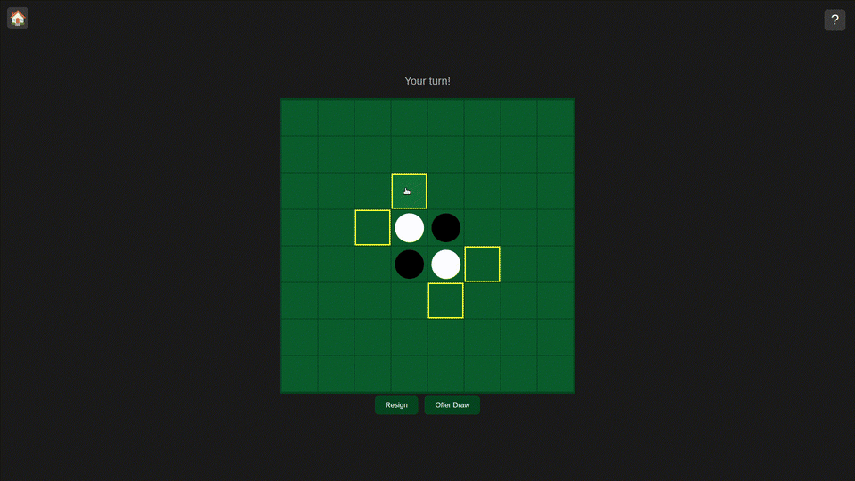

<h1 align="center">Flask Othello</h1>



A full Othello (Reversi) web app. Play against a friend, or a bitboard-powered AI, right in your browser.

## Features

- **Player vs Player** - create a game, share the link or a short join code, and play!
- **Player vs CPU** - three difficulty levels:
    - Easy (random moves)
    - Medium (minimax with depth=1)
    - Impossible (minimax with depth=5)
- **Spectating** - anyone with the link can watch a game in progress
- **Draw offers & resignation** - offer/accept/decline a draw, or resign outright (with confirmation). The AI decides its response to draw offers based on piece count
- **Game archives & replay** - every finished game gets a permanent, read-only page with full move-by-move history you can step through
- **Juice** - piece flip animations, legal-move highlighting, and an in-app rules popup

## Running locally (Linux / macOS)

```bash
git clone https://github.com/vindognz/flask-othello
cd flask-othello
python -m venv env
source env/bin/activate
pip install -r requirements.txt
gunicorn -w 1 --threads 4 -b 0.0.0.0:5000 app:app
```

Then visit `http://localhost:5000`.

> Note: game state is stored in memory, so a server restart clears all active games and archives.

## Tech stack

- **Backend**: Python + Flask, in-memory game state (no database!)
- **AI**: bitboard board representation (two 64-bit ints), minimax with alpha-beta pruning and a transposition table
- **Frontend**: vanilla JavaScript and CSS (no frameworks, no build required)

## AI

The AI uses a bitboard representation of the board using two 64-bit integers. This allows legal moves and board operations to be performed efficiently using bitwise operations.

Search uses minimax with alpha-beta pruning and a transposition table.

### Thanks for voting :)